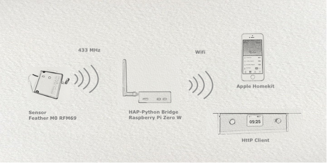
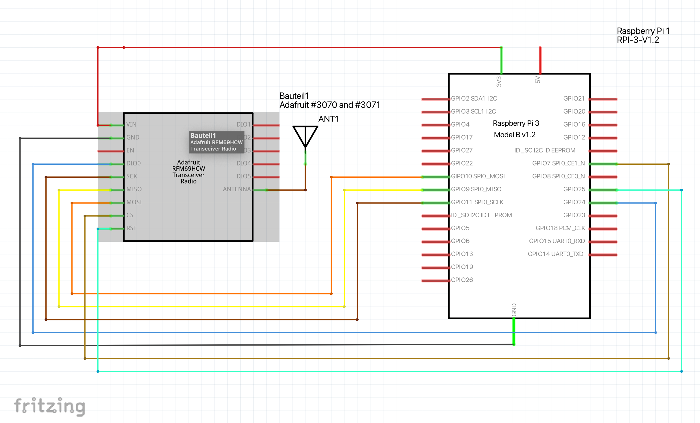

# HAP-Python-RFM69



Bridge RFM69 433 MHz devices with the Apple Homekit. To get sensor data or control for examle switches, small data packets needed to be exchange. The coverage of a 433 MHz network is more effective then a wifi network. Sensors can work with small batteries over years.  

This implementation has two parts: The Homekit Gateway and a RFM69 Bridge to requests and receive data to/from 433MHz devices. The examples here are a simple weather sensor, capacitive soil moisture sensor, room sensors and a switch to control a sprinkler.

## Equipment

For the Homekit Gateway and the RFM69 Bridge,  you can use Raspberry Pi's (Zero W, 3B+ 4) or any other linux systems.
The RFM69 sensor/switch devices itself, in my case is a Adafruit RFM69HCW Feather board.



## Installation

### HAP-Python

To use this fist you need to install the HAP-Python HAP-Python <https://github.com/ikalchev/HAP-python> by:

```python
sudo apt-get install libavahi-compat-libdnssd-dev
pip3 install HAP-python[QRCode]
```

I like to define my own accessories, so i use my own service and characteristic definitions.
Some service and characteristic definitions, categories and permissions seems to be de outdated in the HAP-Python repository. If you like to use the newer definitions, copy "const.py" to "/usr/local/lib/python3.x/dist-packages/pyhap" and use "loader" to get the newer definitions.(state October 2022)

```python
loader = Loader(path_char='CharacteristicDefinition.json',path_service='ServiceDefinition.json')
...
driver = AccessoryDriver(port=51826, persist_file= persist_file, loader=loader)
```

Next you need to specify the RFM69 bridge and the RFM69 device node number devices in a dictionary, with Node name and node number. See config.py. Note, that the name of your node must be the same as the corresponding HAP-Python device class.
The main script will read the node definition and load the corresponding device class for further information about the device itself. Each device class represent a HAP Accessory.

In Device.py you can find two examples: a weather sensor and a switch (here a imension pump)
Each device class call data from the 433MHzBridge in the set interval. The 433MHzBridge use a Flask server to answer these requests and return sensor values, or send commands to and receive states from the switch.


### 433MHzBridge

For the 433MHzBridge you will need Flask.

```python
sudo pip3 install flask

```
Additional information in the example folder README.

For the sensor/switch devices, i use the "unreliable" RFM69 communication. That means communication without the RFM69 send/wait/ack senquence. This because to save battery capacity. In the exampe weather sensor, the sensor  send values unattended each 30 minutes and go into deep sleep. For the switch, control is more important,  the RFM69 bridge make 4 attempts and wait 300 ms, before state, the switch is unreachable. In my case, through thick wall, plants, obstacles, the response time is allmost around 0.05 seconds.
